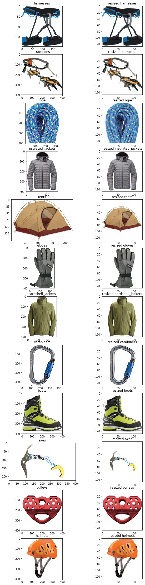

# Challenge 1: Establishing Base Camp

## Background

Before working on a computer vision solution, the data science team at Adventure Works wants to standarize on a data science development environment.

After provisioning the development environment, you can use it to explore the images that Adventure Works has collected, and prepare them for use in training a machine learning model.

## Challenge

This challenge consists of three tasks:

1. Provision a Data Science Virtual Machine in Azure
2. Explore the JupyterHub Environment
3. Prepare Image Data for Machine Learning

Each task includes some detailed requirements and hints to help you. Additionally, there's a **References** section at the bottom of this page with links to useful resources.

### 1. Provision a Data Science Virtual Machine in Azure

In this Hack, you will use the Azure-based Data Science Virtual Machine (DSVM) as a development environment for machine learning. This virtual machine image includes essential data science tools, including the Jupyterhub notebook environment; in which you will create and run Python code.

To set up the environment, sign into your Azure subscription the <a href="https://portal.azure.com" target="_blank">Azure portal</a>, and create an Azure Data Science Virtual Machine (DSVM).
The following DSVM configuration has been found to work well, and is the recommended environment for this hack:

- DSVM Image: *Data Science Virtual Machine for Linux (Ubuntu)*
- Region: _Any available region_
- Size:  _NC6_ (Filter by **Family** to list **GPU** enabled images)
- Authentication type:  _Password_
- Username: _(Specify a **lowercase** user name of your choice)_
- Password: _(Specify a complex password)_

After the DSVM has been created, connect to Jupyterhub and log in using the username and password you specified when provisioning the DSVM.

#### Hints

- If you are using an Azure subscription provided as an employee benefit, the ability to create a GPU-based VM may be restricted to specific regions. If you find that no GPU images are available, go back, change regions, and try again.
- When provisioning the DSVM, specify a **lowercase** user name and be sure to choose **Password** as the authentication type.
- Jupyterhub is at **https://*your.dsvm.ip.address*:8000**. For information about using Jupyterhub, see <a href="https://www.youtube.com/watch?v=4b1G9pQC3KM" target="_blank"> this video</a> or <a href="https://docs.microsoft.com/azure/machine-learning/data-science-virtual-machine/linux-dsvm-walkthrough/?wt.mc_id=OH-ML-ComputerVision#jupyterhub" target="_blank">this document</a>.
- To get to the Jupyterhub, you must click through the non-private connection warnings in browser - this is expected behavior.
- If  Jupyterhub takes a while to load, click the **jupyter** logo to open the folder tree page.

See the **References** section below for more guidance and help.

### 2. Explore the JupyterHub Environment

In the Jupyterhub folder tree, note that there are already folders and notebooks that you can use to learn about various data science frameworks and technologies.

In the **New** menu, click **Terminal** to create a new terminal session, which should open with the working directory set to your home folder (*username*@*dsvm*:/data/*username*). The terminal shell is a useful way to enter operating system (OS) commands.

Enter the following command to change the current directory to the root of the JupyterHub notebooks tree:

```shell
cd notebooks
```

Now enter the following command to clone this GitHub repository to this folder:

```shell
git clone https://github.com/GraemeMalcolm/ready2019
```

After the repo has been downloaded, switch back to the tab containing the folder tree, refresh the view if necessary, and verify that the **ready2019** folder has been downloaded.

### 3. Prepare Image Data for Machine Learning

In the **ready2019/notebooks** folder, open the **01-DataPrep.ipynb** notebook and examine the notes and code it contains. Run each code cell, and review the output. The code in the notebook:

1. Downloads and extracts a folder hierarchy of image files that you will use in subsequent challenges.
2. Displays the first image in each folder - each folder represents a category or *class* of product image.
3. Standardizes the images so that they are a common format and size.

> **Note**: In this challenge, the code has been provided for you to enable you to get familiar with the Jupyter notebook environment. However, you should take the time to review the code and ensure you understand it, because in later challenges you will need to write your own code to perform similar tasks!

#### Hints

- Use the **Python 3.5** kernel in Jupyterhub on your DSVM.
- The <a href="https://docs.python.org/3.6/tutorial/stdlib.html#operating-system-interface" target="_blank">**os** Python module</a> includes functions for interacting with the file system.
- The <a href="https://matplotlib.org/2.0.2/index.html" target="_blank">**matplotlib** Python library</a> provides functions for plotting visualizations and images.
- To ensure that plots are displayed in a notebook, you must run the following *magic* command before creating the first plot:

    `%matplotlib inline`

- Images are essentially just numeric arrays. In the case of color images, they are three-dimensional arrays that contain a two-dimensional array of pixels for each color channel. For example, a 128x128 Jpeg image is represented as three 128x128 pixel arrays (one each for the red, green, and blue color channels). The Python <a href="https://docs.scipy.org/doc/numpy/reference/arrays.html" target="_blank">*NumPy* library</a> provides a great way to work with multidimensional arrays. For example, you can use:
  - `numpy.array(my_img)` to exlicitly convert an image object to a numpy array.
  - `my_array.shape` to determine the size of the array dimensions - an image has three dimensions (height, width, and channels)
- There are several Python libraries for working with images, as noted in the **References** section. You can use whatever combination of these packages works best to process your images, and rely on the **numpy** array data type as an intermediary format.
- The <a href="https://pillow.readthedocs.io" target="_blank">*PIL* library</a> uses a native format for images, but you can easily convert PIL images to numpy arrays using the `numpy.array()` function, and you can convert a numpy array to a PIL Image object by using the `Image.fromarray()` function. You can also convert PIL images between image formats (for example, from a 4-channel PNG to a 3-channel JPG) using the `my_img.convert()` function.
- To open a file as a PIL Image object, use the `Image.open()` function. To save a PIL image as a file, use the `my_img.save()` function.
- A common strategy to resize an image while maintaining its aspect ratio is to:
  1. Scale the image so that its largest dimension (height or width) is set to the target size for that dimension. You can use the PIL `my_image.thumbnail()` method to accomplish this.
  2. Create a new image of the required size and shape with an appropriate background color. You can use the PIL `Image.new()` function to accomplish this.
  3. Paste the rescaled image into the center of the new background image. You can use the PIL `my_bg_img.paste()` function to accomplish this.
- When using <a href="https://matplotlib.org/2.0.2/users/image_tutorial.html" target="_blank">*matplotlib*</a> to plot multiple images in a grid format, create a figure and add a subplot for each image by using the `my_figure.add_subplot()` function. The parameters for this function are:
  - The total number of *rows* in the grid.
  - The total number of *columns* in the grid.
  - The *ordinal position* of this subplot in the grid (starting with 1 in the top-left cell).

## Success Criteria

To complete this challenge successfully, you must run the code in the **DataPrep.ipynb** notebook in the Jupyterhub environment hosted by your DSVM instance. The final code cell in the notebook should display the original and resized version of the first image in each folder, similar to the following:



When your coach has verified your team's solution, you can proceed to the [next challenge](Challenge02.md).

## References

### Data Science Virtual Machine

- <a href="https://docs.microsoft.com/en-us/azure/machine-learning/data-science-virtual-machine/dsvm-ubuntu-intro" target="_blank">Provisioning a Ubuntu DSVM</a>

### Jupyterhub and Notebooks

- <a href="https://docs.microsoft.com/en-us/azure/machine-learning/data-science-virtual-machine/linux-dsvm-walkthrough#jupyterhub" target="_blank">Jupyterhub in the DSVM</a>
- <a href="https://jupyterhub.readthedocs.io/en/stable/" target="_blank">Jupyterhub documentation</a>
- <a href="https://jupyter-notebook.readthedocs.io/en/latest/" target="_blank">Jupyter Notebooks documentation</a>

### Python Fundamentals

- <a href="https://docs.python.org/3.6/" target="_blank">Python 3.6 documentation</a>
- <a href="https://docs.scipy.org/doc/numpy/user/index.html" target="_blank">NumPy User Guide</a>
- <a href="https://docs.python.org/3.6/library/pdb.html" target="_blank">The Python Debugger</a>

### Image Processing

- <a href="https://matplotlib.org/2.0.2/users/image_tutorial.html" target="_blank">Using *matplotlib* for image I/O and plotting</a>
- <a href="https://pillow.readthedocs.io/en/5.3.x/reference/Image.html" target="_blank">Using the *PIL Image* module for I/O and more </a>
- <a href="http://pillow.readthedocs.io/en/5.3.x/reference/ImageOps.html" target="_blank">Using the *PIL ImageOps* module for image manipulation</a>
- <a href="https://docs.scipy.org/doc/numpy-1.13.0/reference/routines.io.html" target="_blank">Using *NumPy* for image I/O</a>
- <a href="http://www.scipy-lectures.org/advanced/image_processing/" target="_blank">Using *NumPy* for image manipulation/processing/visualization</a>