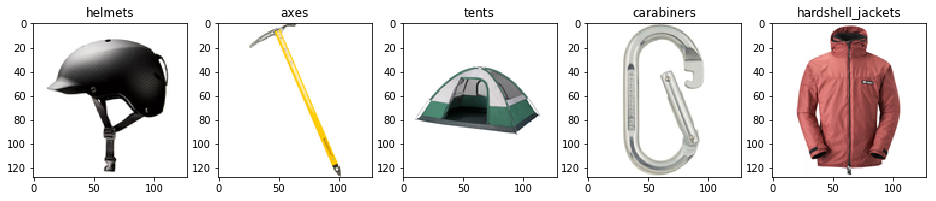

# Challenge 4:  Following the Marked Trail

## Background

Previously, you build a convolutional neural network (CNN) to classify product images. A CNN typically consists of multiple *convolutional*, *pooling*, and *drop* layers that extract features from images, and one or more dense *fully-connected* layers that map those features to classes.

*Transfer Learning* is a commonly used machine learning technique in which you can leverage the feature extraction layers from an existing model, and add your own fully-connected layer to predict classes from the extracted features.

## Prerequisites

* A Data Science Virtual Machine (DSVM)
* The resized  ***gear*** image data fom the previous challenges.
* An installation of the latest version of your chosen deep learning framework(s) based on the **References** section below.

## Challenge

There are three elements to this challenge:

1. Explore a sample transfer learning model.
2. Use transfer learning to train a classifier based on an existing model.
3. Use your model with new data.

### 1. Explore a sample transfer learning model

Explore the notes and code in the **04-Transfer Learning (*framework*).ipynb** notebook in the **ready2019/notebooks** folder to see an example of using transfer learning to train a CNN.

### 2. Use transfer learning to train a model

Create a new CNN by using *transfer learning* to build a classifier on top of the feature extraction layers defined in an existing model.

#### Hints

* - Use the **Python 3.5** kernel in Jupyterhub on your DSVM.
* Base your initial solution on the code in the sample notebook.
* You can use any base model supported by your chosen deep learning framework.
* You may need to resize the images to match the size used to train the base model you select.

### 3. Use your model with new data

Use your model to predict the class of at least five images that are not included in the ***gear*** dataset. You can use the same five images you found in the previous challenge.

## Success Criteria

* Successfully train a CNN based on an existing trained model.
* Show predictions for the five images you identified in the **Challenge** section, like this:

  

  *(Note: Your model is not required to predict the correct class for all of the images, but it would be good if it does!)*

  When your coach has verified your team's solution, you have completed all of the challenges - congratulations!

## References

* <a href="http://cs231n.github.io/transfer-learning/" target="_blank">Transfer Learning Notes</a>
* <a href="https://pytorch.org/tutorials/beginner/transfer_learning_tutorial.html" target="_blank">Transfer Learning with PyTorch</a>
* <a href="https://blog.keras.io/building-powerful-image-classification-models-using-very-little-data.html" target="_blank">Transfer Learning with Keras</a>
* <a href="https://www.tensorflow.org/hub/tutorials/image_retraining" target="_blank">Transfer Learning with TensorFlow</a>
* <a href="https://cntk.ai/pythondocs/CNTK_301_Image_Recognition_with_Deep_Transfer_Learning.html" target="_blank">Transfer Learning with CNTK</a>
