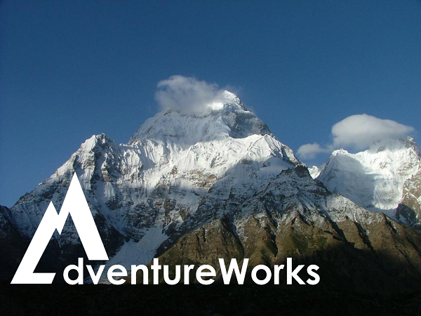

# Ready 2019

## Deep Learning for Computer Vision Hack

Hello and welcome to this challenge-oriented hack event. This experience will be presented as a series of challenges, each one adding a new level of depth and complexity to a machine learning solution for computer vision.

Teams should already be assigned and seated together. While you will work individually to review the learning resources provided, it's important that you share ideas and insights with your team. The hack is a team event, and you must ensure that all team members not only solve the challenges, but fully understand the solution they have created.

Team coaches are the first point of contact, and are available for technical support during the hack, but they will not solve challenges or provide answers for teams.

## Scenario

Adventure Works, a major outdoor and climbing gear retailer, wants to understand customer behavior by learning more about the gear that consumers wear; and plans to accomplish this with powerful Microsoft and open-source technologies for computer vision.

Your team has been invited to work with Adventure Works and build a series of computer vision solutions based on the image data they have collected.

## Challenges

Each challenge will be preceded by a short presentation to set the context and explain fundamental concepts. Aftre the presentation, you will have a limited amount of time to review the resources provided and create your own solution that meets the challenge requirements.

* [Challenge 1: Establishing Base Camp](Challenge01.md)
* [Challenge 2: Deep in the Woods](Challenge02.md)
    * If Time permits, [Challenge 2b: Following the Marked Trail](Challenge02b.md)
* [Challenge 3: A Run in the Clouds](Challenge03.md)

Each challenge covers a different aspect of machine learning for computer vision, and all of them will require you to write Python code. You can reference the <a href="https://docs.python.org/3.6/" target="_blank">Python 3.6 documentation</a> for help.